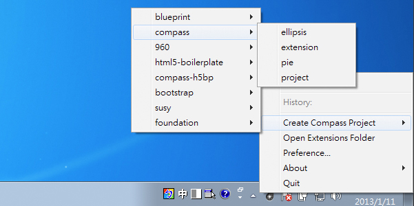
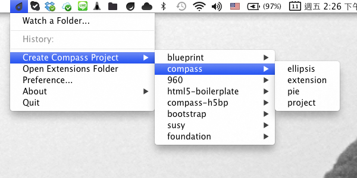
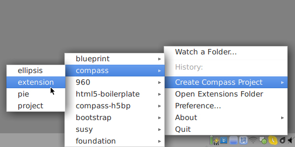
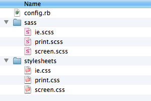
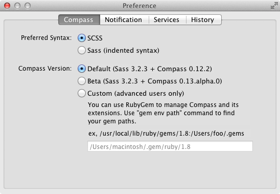
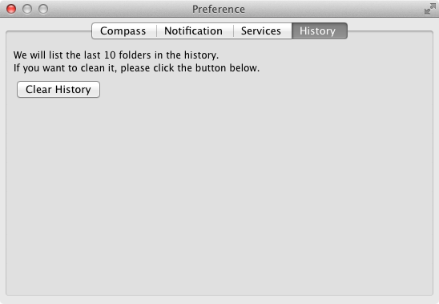

# Compass.app

Compass.app は Sass と Compass が使いたいですが、コマンドラインで設定するのは大変と思っている方のために作ったGUIツールです。 Windows / Mac OS / Linux 全てに対応しています。 インストールも必要ない、シンプルなツールです。

[Compass.app のオフィシャルサイト](http://compass.handlino.com/)で購入できます。購入した後にはダウンロードリンクを含むメールが届きます。 OS に対応したのをダウンロードして、そして ZIP フアィルを解凍してください。

### Windows
解凍したのは、 Compass.app が必要なフアィルを含むフォルダです。このフォルダを好きな所に配置して、 Dropbox に置いても大丈夫です。 Compass-app.exe をクリックして起動しますと、タスクトレイにグレーアイコンが表示されます。

 

### Mac OS
解凍したのは、 Compass.app です、好きな所に配置してください。 Dropbox に置いても大丈夫です。 Compass.app をクリックして起動しますと、メニューバーにグレーアイコンが表示されます。

  

### Linux
解凍したのは、 Compass.app が必要なフアィルを含むフォルダです。このフォルダを好きな所に配置して、 Dropbox に置いても大丈夫です。 run.sh を実行すると、メニューバーにグレーアイコンが表示されます。

  

** *注: Compass.app は JAVA で開発したので、起動は数秒かかります。お待ちになってください。 **

## プロジェクトを作成

シンプルな compass プロジェクトを例にします。 Compass.app を起動し、アイコンをクリックして、"Create Compass Project" -> "compass" -> "project" を順番に選んで、そしてプロジェクトの名前を入力してセーフします。

セーフした後、作成成功を示すダイアログボックスが表示されます。それと同時にアイコンはオレンジ色になります。それは Compass.app がこのプロジェクトを "Watch" しているの意味です。

プロジェクトフォルダの構成は以下のようになっています：

    awesome-website/
      - sass/
        - screen.scss
        - ...
      - stylesheets/
        - ...
      - .sass-cache/   // 隠し sass cache フォルダです。触れないでください。
      - config.rb      // Compass 設定フアィルです。削除しないでください。

そしてお気に入りの IDE でプロジェクトを編集ができます。 SCSS と Sass フアィルが保存の際自動的に CSS にコンパイルされます。

## Preferences 解説
Compass.app アイコンをクリックして "Preferences" を選びますと、いろんな設定ができます。

### Compass

* Preferred Syntax:   
Sass には SCSS (.scss) と Sass (indented syntax, .sass) という2種類のシンタックスがあります。 Compass.app で両方も使えます。ここで選ぶのはプロジェクト作成する時、テンプレートのシンタックスです。

* Compass Version:   
Compass.app の初期値は [ Compass の最新安定版バージョン](http://compass-style.org/CHANGELOG/) を使用しています。もし他の Sass / Compass ヴァージョンが使いたいおよび RubyGems でパッケージ管理したい場合はら、 "Custom" を選んでください。**注意！上級ユーザーのみにお勧めしています！**

### Notification

Compass.app は [Growl](http://growl.info/) に対応していますので、欲しいメッセージタイプを選べます。デバッグのためのログ出力もできます。 

### Services

**Enable Web Server:**   
ここにチェックしますと、 Compass.app はプロジェクトパスで軽量 Web サーバ (WEBrick) を起動します。ブラウザに `http://localhost:24680` を入力しますと、実際のプロジェクトページが見えます。ポートの初期値は変更可能です。

**Enable LiveReload:**   
Compass.app 1.2+ は LiveReload をサポートしています。 LiveReload を使用するとファイルを保存した時に自動でブラウザをオートリロードします。ご利用にはブラウザエクステンションのインストールが必要です。 Web サーバと LiveReload 両方もチェックしますと、 "[LiveReload.js](https://github.com/livereload/livereload-js)"　が使えられます。(@livereload によりMITライセンスで公開されて、感謝しています。) [LiveReload 2](http://livereload.com/)もお勧めです。

* [LiveReloadブラウザエクステンション](http://help.livereload.com/kb/general-use/browser-extensions)
* 古いヴァージョン：
    - Safari: [Download LiveReload 1.6.2 extension](https://github.com/downloads/mockko/livereload/LiveReload-1.6.2.safariextz). 
    - [Chrome](https://chrome.google.com/extensions/detail/jnihajbhpnppcggbcgedagnkighmdlei)
    - [Firefox](https://addons.mozilla.org/zh-TW/firefox/addon/livereload/)

もしブラウザエクステンションを使いたくないなら、HTMLの中に以下のコードを貼ると LiveReload は自動的に起動します。

    

### History

"Clear History" ボタンをクリックすると、プロジェクトの履歴リストは削除されます。

## Options
"Watch" しているのプロジェクトは、オプション変更できます。出力CSSの整形と "line comments" / "debug info" の付加もできます。

## 他の設定
ここからは変更したい可能性が高いが、 "Preferences" および "Options" にはない二箇所の設定を説明します：

### フォルダ名前の変更
CSS作成フォルダ名前の初期値は "stylesheet" です。もし変更したいなら、 `config.rb` のこの部分を編集してください：

    css_dir = "stylesheets"
    
`config.rb` を保存した後は、 "Stop Watching …" をクリックして、更にもう一回このプロジェクトを "Watch" すると、CSS作成フォルダの名前は変わります。

[image-url()](http://compass-style.org/reference/compass/helpers/urls/#image-url) に関するの Compass helper が使いますけれど、画像フォルダの名前は "images" ではない場合は、 `config.rb` のこの部分を編集してください：

    images_dir = "images"

### 絶対パスを相対パスに変更
初期設定によると、 [image-url()](http://compass-style.org/reference/compass/helpers/urls/#image-url) に関するの Compass helper を使うなら、作成されたCSSの中には絶対パスの状態になります。相対パスに変更したいなら、 `config.rb` の中に

    relative_assets = true

を入力してください。

** 注意！ `config.rb` 更新後は必ず "Stop Watching …" 、さらにもう一回このプロジェクトを "Watch" して、新しい設定を使用します **

今の設定は他のプロジェクトにも使いたい場合は、 `config.rb` をそのプロジェクトフォルダにコピーしたら使用できます。

## 既存プロジェクトに Compass.app を使用します
既存プロジェクトに Compass.app を使用したい時、プロジェクトフォルダの中には以下の通り必要です：

* **sass フォルダ**： `.scss` や `.sass` ファイル、どれか一つが必要です。 
* **config.rb**： 他のプロジェクトからコピーしてください。必ず中の設定を検査します。

** 注: もし初期設定を一切変更しない、ただ Compass.app で Sass をコンパイルする場合、 `config.rb` が必要ない [Sass Mode](https://github.com/handlino/CompassApp/wiki/Sass-mode) も使えられます。 **

既存プロジェクトのCSSについては、時間があれば SCSS にリライトの方がいいです。もし時間がないなら、 SCSS は CSS3 のシンタックスのスーパーセットですので、簡単に既存 CSS のファイル名拡張子 `.css` を `.scss` に変更しますや SCSS `@import` を使用すればオッケーです。

## SASS & Compass 参考リンク

* [Sassの公式Webサイト](http://sass-lang.com/)
* [Compassの公式Webサイト](http://compass-style.org/)
