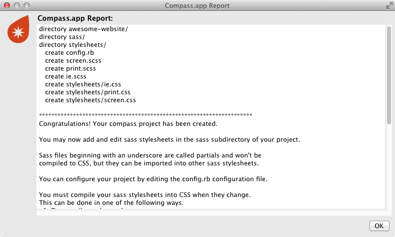
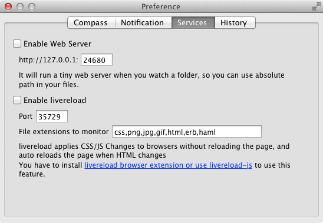

# Getting Started With Compass.app

First, download the Compass.app which corresponds to your OS, then unzip the file. Next, proceed to the section below for your OS.

### Windows
You will get a folder containing all the Compass.app files. You can put this folder anywhere you want. Run Compass-app.exe and you'll see a little gray icon appear in the Windows notification area.  

  

### Mac OS
You will get a file named Compass.app. You can put it anywhere you want. Start the app and you'll see a little gray icon appear in the menubar.  

  

### Linux
You will get a folder containing all the Compass.app files. You can put this folder anywhere you want. Execute run.sh and you'll see a little gray icon appear in the menubar.  

  

** NOTE: Compass.app is written in Java, so it will take a few seconds to start.**

## Creating Compass Projects

To create a compass project, click the Compass.app icon and choose "Create Compass Project" -> "compass" -> "project". Give your new project a name and save it.

A dialog window will appear saying your project has been created. Also, the icon turns orange, which means Compass.app is "watching" your project. Now you can use your favorite editor to start coding. When you change a Sass file, it automatically compiles into a corresponding CSS file.

The project folder should look like this:

    awesome-website/
      - sass/
        - screen.scss
        - ...
      - stylesheets/
        - ...
      - .sass-cache/   // The hidden sass cache folder. Do not touch.
      - config.rb      // Compass settings. Do not remove.

## Preferences
There are several settings in the preferences as follows.

### Compass

* Preferred Syntax:   
Sass has two syntax choices: SCSS (.scss) and indented syntax (.sass). Compass.app supports both, but you must choose which one you want for generating files from templates.

* Compass Version:   
Compass.app always uses [the latest stable release of Compass](http://compass-style.org/CHANGELOG/) by default. If you want to use other Sass/Compass versions, or use RubyGems to manage Compass extensions manually, please use the "Custom" option. **WARNING: This is for advanced users only.**

### Notification

Compass.app supports [Growl](http://growl.info/). You can decide which types of notifications you want. Compass.app can also generate a log file for debugging purposes.

### Services

**Enable Web Server:**   
If you have enabled this option, Compass.app will start a tiny web server (WEBrick) from your project path. You can instantly check your design by opening `http://localhost:24680` in your browser. You can also modify the default port.

**Enable LiveReload:**   
Compass.app 1.2+ has built-in LiveReload support, so you can stop refreshing your browser manually. Browser extensions must be installed to make this work. If you have enabled both web server and livereload, you can even use the [livereload-js](https://github.com/livereload/livereload-js) feature. (Our thanks to @livereload for the MIT License.) We also recommend [LiveReload 2](http://livereload.com/).

* [Browser extensions from LiveReload](http://help.livereload.com/kb/general-use/browser-extensions)
* Older versions:
    - Safari: [Download LiveReload 1.6.2 extension](https://github.com/downloads/mockko/livereload/LiveReload-1.6.2.safariextz). Double-click and confirm installation.
    - [Chrome](https://chrome.google.com/extensions/detail/jnihajbhpnppcggbcgedagnkighmdlei)
    - [Firefox](https://addons.mozilla.org/zh-TW/firefox/addon/livereload/)

If you do not want to install browser extensions, you can use livereload-js by pasting this code into your HTML:

    

Then LiveReload will work automatically.

### History

Click the "Clear History" button to destroy the history list.

## Options
You can change the options of your output CSS for any project being "watched". Select your preferred output type or add "line comments"/"debug info" inside the CSS file.

## Other Settings
There are some more settings you might want to change but are not found in "Preferences" or "Options". Two common situations are shown below: 

### Changing The Default Folder Name
The defalut ouput CSS file is saved to a folder named "stylesheet." If you want to change the folder's name, open the `config.rb` file and edit this line:

    css_dir = "stylesheets"
    
Modify the name to what you want, like this:

    css_dir = "css"
    
After save, stop watching and watch the project again then the css folder's name will be changed.

If you want to use some Compass helper related to [image-url()](http://compass-style.org/reference/compass/helpers/urls/#image-url) but your image folder isn't named "images", you have to modify this line:

    images_dir = "images"

to correspond to your image folder name.

### Changing Absolute Path To Relative Path
By default, if you use a Compass helper related to [image-url()](http://compass-style.org/reference/compass/helpers/urls/#image-url), Compass.app generates an absolute path in your CSS file. To change the default setting to a relative path, paste this into your `config.rb`:

    relative_assets = true

** Be sure to stop watching and watch the project again after modifying "config.rb". **

If you want to use your current settings with another project, copy `config.rb` to the other project's folder.

## Using Compass.app With Existing Projects
If you want to use Compass.app to edit css in an existing project that was not created with Compass.app, just make sure the project folder contains:

* **sass folder**: must have at least one `.scss` or `.sass` file
* **config.rb**: copy from another compass project, be sure to check the settings are what you want

then you can watch the project folder.

** NOTE: If you just want to use default settings to compile Sass files, you can use Compass.app in [Sass Mode](https://github.com/handlino/CompassApp/wiki/Sass-mode) without copying config.rb. **

It is best to rewrite your original CSS files, however, because SCSS is a superset of CSS3's syntax, you may simply rename your original css files with the filename extension `.scss` or use `@import` in your SCSS files.

## SASS & Compass References

With Compass.app you can easily use Sass and Compass. If you need to know more details about them, check the links below: 

* [SASS](http://sass-lang.com/)
* [Compass](http://compass-style.org/)
